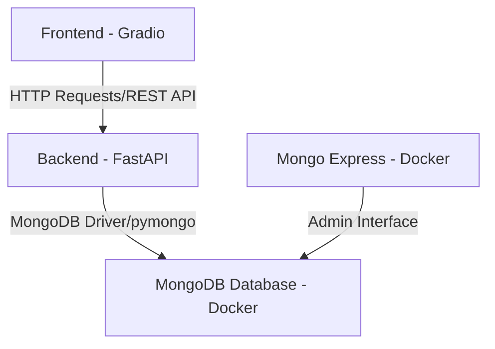

# DevOps Documentation

## Application Architecture

### Component Connections

| Connection | Description |
|------------|-------------|
| **Frontend → Backend** | Frontend makes HTTP calls to the backend to send or retrieve data via REST API |
| **Backend → MongoDB** | The backend uses a MongoDB client library (pymongo) to perform database operations |
| **Mongo Express → MongoDB** | Mongo Express provides a web-based admin panel connected directly to the MongoDB database |

## Docker Configuration

The application is containerized using Docker with separate Dockerfiles for each component:

- Separate Dockerfile for backend application
- Separate Dockerfile for frontend application
- Docker Compose file to orchestrate and run both frontend and backend services

## Kubernetes Configuration

Kubernetes is used for orchestration with the following configuration files:

### Secret Management
- Secret configuration file for maintaining sensitive information

### Application Management
- Configuration files for general application settings

### Deployments and Services
- Deployment and Service files for:
  - Frontend application
  - Backend application
  - MongoDB database
  - Mongo Express admin interface
